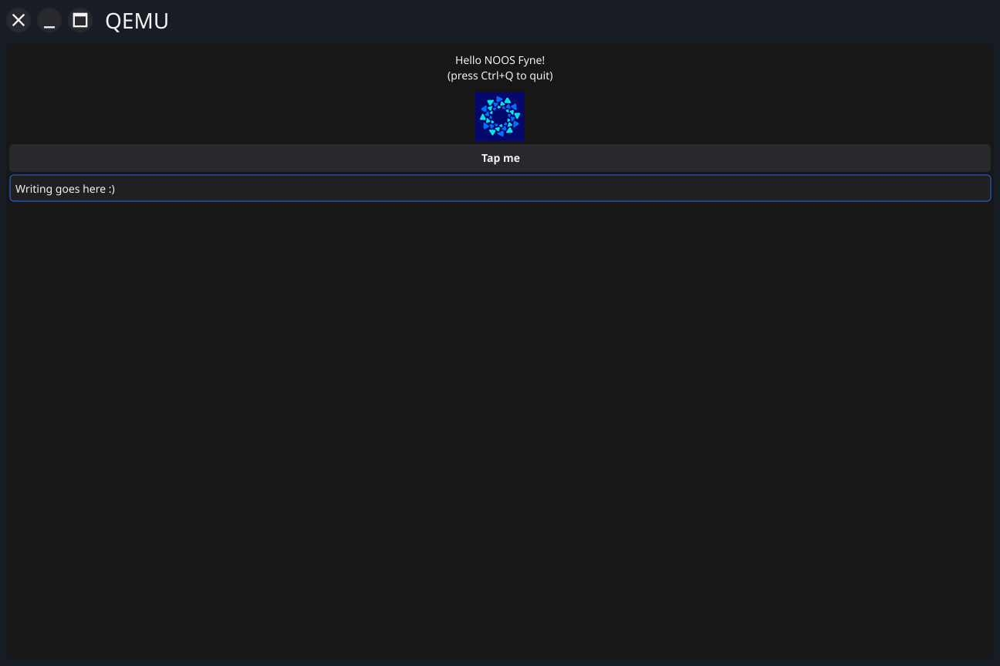

# Fyne NOOS demo

This project shows how a Fyne app can be set up to run with no operating system.

It supports:
* [Tamago](https://github.com/usbarmory/tamago) Go compiler
* (in theory the Go [none](https://github.com/golang/go/issues/73608) architecture)

## TODO

- [ ] Touch (mouse simulation?) input

## Sponsors

This work was created by the kind support of Glasklar Teknik.
Glasklar Teknik is a sister company of Mullvad VPN.
